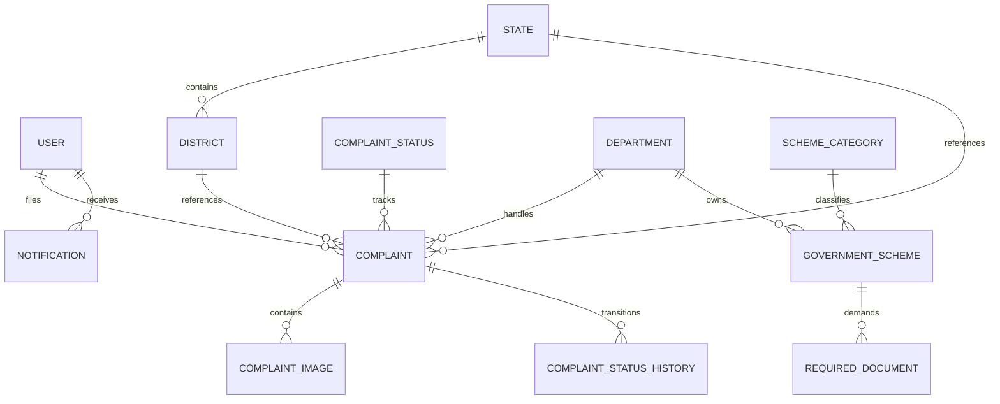

# 🏛️ GovConnect: AI-Powered Government Complaint & Scheme Recommendation Platform

> **Smart India Hackathon (SIH) Project**
> 
> A complete, enterprise-grade citizen portal featuring a modern **React 19 Frontend** and a robust **Django REST Framework Backend** with PostgreSQL, JWT Auth, dynamic Indian locations, automated notification signals, and a personalized welfare schemes recommender.

---

## 📖 Table of Contents
- [Project Overview](#-project-overview)
- [Key Features](#-key-features)
- [Tech Stack](#-tech-stack)
- [Project Structure](#-project-structure)
- [Database Architecture](#-database-architecture)
- [System Architecture](#-system-architecture)
- [API Documentation](#-api-documentation)
- [Installation & Setup](#-installation--setup)
  - [Backend Setup](#1-backend-setup)
  - [Location & Schemes Seeding](#2-seeding-database-locations--schemes)
  - [Frontend Setup](#3-frontend-setup)
- [Docker Support](#-docker-support)
- [Development Guidelines](#-development-guidelines)

---

## 📌 Project Overview
**GovConnect** empowers citizens to bridge the gap between their grievances and administrative resolutions. The platform uses AI to classify complaints, automatically assign them to respective departments, track status history via an interactive timeline, and recommend eligible central/state welfare schemes based on user details and complaint context.

---

## 🔒 Key Features
* **Dual Auth Portal**: Secure JWT authentication supporting traditional Email/Password and OTP-based mobile logins.
* **Dynamic Location Dropdowns**: Dropdowns for Indian states and districts mapped directly to database PKs, ensuring nested district filtering based on the selected state (prevents invalid location constraints).
* **Automated Notification Signals**: Django `post_save` signals dynamically generate citizen alerts upon complaint submission, reflecting immediately in the frontend notification panel.
* **Welfare Schemes Browser**: Explore government programs filtered by State, Department, and Category, with detailed eligibility, benefits, and required document criteria.
* **Interactive Dashboard**: Modern visualization of complaint resolution statistics, status distribution (Doughnut Chart), and monthly filing trends (Bar Chart).

---

## 🛠 Tech Stack

### Frontend
* **Core**: React 19, Vite, React Router DOM v6
* **State & Query**: TanStack Query (React Query v5), Context API
* **Styling**: Tailwind CSS v4, Framer Motion (for premium micro-animations)
* **Form & Validation**: React Hook Form, Custom Validator utilities
* **Visualizations**: Chart.js, React-ChartJS-2
* **Feedback**: React Toastify, React Icons (Hi2 & Fi)

### Backend
* **Core Framework**: Django 5.x, Django REST Framework (DRF)
* **Authentication**: JWT via SimpleJWT
* **Database**: PostgreSQL (Dockerized or Local)
* **Filtering & Searches**: django-filter

---

## 📂 Project Structure

```
gov_complaint_schemes/
├── backend/                  # Django REST Framework backend
│   ├── accounts/             # Authentication & user profile management
│   ├── complaints/           # Grievance processing, services, & signals
│   ├── departments/          # Government departments registry
│   ├── categories/           # Complaint categories
│   ├── locations/            # Indian states & districts registry
│   ├── schemes/              # Welfare schemes & required documents
│   ├── backend/              # Core project settings and URL configuration
│   ├── manage.py             # Django entrypoint
│   └── requirements.txt      # Python dependencies
│
├── frontend/                 # Vite + React 19 Frontend
│   ├── src/
│   │   ├── components/       # Layouts, Navbar, Sidebar, Loading elements
│   │   ├── context/          # AuthContext with token refresh logic
│   │   ├── hooks/            # TanStack Queries (useComplaints, useSchemes, useNotifications)
│   │   ├── pages/            # Dashboard, Complaint Management, Schemes, Auth
│   │   ├── services/         # Axios instance, API services wrapper
│   │   ├── utils/            # Validators, formatting helpers, and constants
│   │   └── App.jsx           # Routing mapping
│   ├── tailwind.config.js
│   └── package.json
```

---

## 📊 Database Design



---

## 🔐 API Documentation

### Authentication Endpoints (`/api/auth/`)
* `POST /api/auth/register/` - Create a citizen account.
* `POST /api/auth/login/` - Authenticate via email/phone + password (returns JWT access/refresh tokens).
* `GET /api/auth/profile/` - Fetch authenticated user details.
* `PATCH /api/auth/profile/` - Update profile address, state, district, or phone.
* `POST /api/auth/token/refresh/` - Refresh expired JWT access token.

### Grievances Endpoints (`/api/complaints/`)
* `POST /api/complaints/create/` - Submit a new complaint (anonymous or public).
* `GET /api/complaints/` - List all complaints (supports search & filters).
* `GET /api/complaints/my/` - Fetch complaints submitted by the authenticated citizen.
* `GET /api/complaints/{id}/` - Retrieve full complaint metadata & resolution timeline.
* `POST /api/complaints/{id}/upload-images/` - Attach up to 5 supporting images.

### Welfare Schemes Endpoints (`/api/schemes/`)
* `GET /api/schemes/` - Browse welfare schemes (supports search & filters by category, state, and department).
* `GET /api/schemes/{id}/` - View scheme details, benefit description, and required documents.

---

## 🚀 Installation & Setup

### Prerequisite System Requirements
* Python 3.11+
* Node.js 18+ (npm)
* PostgreSQL (Local database or Docker container)

---

### 1. Backend Setup

Navigate to the backend directory and set up a virtual environment:
```bash
cd backend
python -m venv myenv
```

Activate the environment:
* **Windows**: `myenv\Scripts\activate`
* **Linux/macOS**: `source myenv/bin/activate`

Install dependencies:
```bash
pip install -r requirements.txt
```

Create a `.env` file in the `backend/` folder:
```env
SECRET_KEY=your_production_secret_key
DEBUG=True
DB_NAME=gov_complaint_db
DB_USER=postgres
DB_PASSWORD=your_password
DB_HOST=localhost
DB_PORT=5432
```

Run database migrations:
```bash
python manage.py makemigrations
python manage.py migrate
```

---

### 2. Seeding Database (Locations & Schemes)

The database includes a default seed command as well as custom scripts targeting Smart India Hackathon location datasets.

**Seed Core Metadata (Departments, Statuses, Base Categories)**:
```bash
python manage.py seed_data
```

**Seed Complete Indian States & District Lists** (Seeds all 30 districts of Odisha, all 24 districts of Jharkhand, all 38 districts of Bihar, and major districts for other states):
```bash
python seed_locations.py
```

**Seed Government Welfare Schemes & Requirements**:
```bash
python seed_schemes.py
```

Create a superuser to access the Django Administration Dashboard (`/admin`):
```bash
python manage.py createsuperuser
```

Run the development server:
```bash
python manage.py runserver
```
The API backend will boot up at `http://127.0.0.1:8000/`.

---

### 3. Frontend Setup

Navigate to the frontend directory:
```bash
cd ../frontend
```

Install dependencies:
```bash
npm install
```

Start the Vite React development server:
```bash
npm run dev
```
The React citizen portal will boot up at `http://localhost:5173/`. 

*(Vite configuration includes a proxy mapping `/api` requests automatically to the backend at `http://127.0.0.1:8000` to prevent CORS issues).*

---

## 🐳 Docker Support

You can spin up a dedicated local PostgreSQL database using Docker Compose:
```bash
# Start container in detached background mode
docker compose up -d

# Verify postgres container is running
docker ps

# Tear down container
docker compose down
```

---

## 💻 Development Guidelines
* **Service Layer Pattern**: Keep all core business logic inside `services.py` layers. Views should focus purely on deserializing request inputs and returning API response maps.
* **Circular Import Safety**: Import models inside method definitions (local scope) where cross-referencing occurs (e.g. referencing `Notification` inside `Complaint` signal hooks).
* **React Rendering**: Always safeguard nested JSON objects from the API when rendering directly inside JSX (e.g. using `{scheme.department?.name || scheme.department}` to prevent DOM representation exceptions).
